# Final Project Teknologi Komputasi Awan 2026

**Kelompok:** FP-TKA-B01  
**Mata Kuliah:** Teknologi Komputasi Awan

---

## Anggota Kelompok


| NRP | Nama |
|------------|-----------------------------|
| 5027241010 | Kanafira Vanesha Putri |
| 5027241025 | Christiano Ronaldo Silalahi |
| 5027241037 | Danuja Prasasta Bastu |
| 5027241038 | Moch. Rizki Nasrullah |
| 5027241069 | Prabaswara Febrian Winandika |
| 5027241070 | Zahra Khaalishah |
| 5027241097 | S. Farhan Baig |

---

## Overview

Proyek ini mengimplementasikan **Order Processing Service**, sebuah layanan backend REST API untuk platform e-commerce yang menangani pembuatan pesanan, pengecekan status, pembaruan status, dan riwayat transaksi. Sistem dibangun menggunakan Flask (Python), MongoDB, dan Nginx, serta dikontainerisasi menggunakan Docker Compose dan di-deploy di DigitalOcean.

Proyek ini dikerjakan dalam tiga tahap konfigurasi: **Baseline** (satu VM, satu backend instance, tanpa optimasi), **Baseline Optimized** (satu VM sama dengan penambahan load balancer internal, gevent, index MongoDB, proxy cache, dan connection pool), serta **Multi-VM Optimized** (tiga VM terpisah dengan MongoDB dedicated). Seluruh konfigurasi dirancang dalam batas anggaran $75/bulan (sekitar Rp1.300.000/bulan).

---

## Objectives

- Mendeploy Order Processing Service pada infrastruktur cloud dengan konfigurasi baseline sebagai titik awal pengukuran performa.
- Melakukan optimasi bertahap pada VM yang sama tanpa biaya tambahan (Baseline Optimized).
- Merancang arsitektur multi-VM dengan pemisahan komponen untuk meningkatkan isolasi sumber daya dan keandalan sistem.
- Mengukur dan membandingkan performa ketiga konfigurasi menggunakan Locust load testing dengan 5 skenario pengujian.

---

## Technology Stack

| Komponen | Teknologi | Versi |
|---|---|---|
| Reverse Proxy / Load Balancer | Nginx | 1.25-Alpine |
| WSGI Server | Gunicorn | 23.0.0 |
| Backend Framework | Flask (Python) | 3.0.3 |
| Database | MongoDB | 7.0 |
| Driver Database | PyMongo | 4.8.0 |
| Autentikasi | PyJWT + bcrypt | 2.9.0 / 4.2.0 |
| Containerisasi | Docker + Docker Compose | v3.9 |
| Load Testing | Locust | — |
| Frontend | HTML5 / CSS3 / JavaScript Vanilla | — |
| Cloud Provider | DigitalOcean Droplet | — |

---

## Project Structure

```text
FP-TKA-B01-main/
├── config-baseline.md                     <- Dokumentasi konfigurasi baseline
├── config-baseline-optimized.md           <- Dokumentasi konfigurasi optimized
├── config-multivm-optimized.md            <- Dokumentasi konfigurasi multi-VM
├── docker-compose-baseline.yml            <- Orkestrasi Docker baseline
├── docker-compose-baseline-optimized.yml  <- Orkestrasi Docker optimized
├── docker-compose-multivm-vm{1,2,3}.yml   <- Orkestrasi Docker multi-VM (per VM)
├── nginx.conf                             <- Konfigurasi Nginx baseline
├── nginx-optimized.conf                   <- Konfigurasi Nginx optimized
├── nginx-multivm.conf                     <- Konfigurasi Nginx multi-VM
├── restore-db.sh                          <- Script restore database interaktif
├── Report/
│   ├── baseline/                          <- Screenshot hasil load testing baseline
│   ├── baseline_v2/                       <- Screenshot hasil load testing baseline v2
│   └── optimized/                         <- Screenshot hasil load testing optimized
└── Resources/
    ├── BE/
    │   ├── app.py                         <- Source code Flask backend (baseline)
    │   ├── app_optimized.py               <- Source code Flask backend (optimized)
    │   ├── Dockerfile / Dockerfile-optimized
    │   └── requirements.txt / requirements-optimized.txt
    ├── DB/
    │   ├── dump/orderdb/                  <- Berkas dump BSON (seed data awal)
    │   ├── generate_dump.py               <- Script pembuatan data realistis
    │   ├── init-mongo.sh                  <- Script seed otomatis saat init container
    │   └── init-indexes.js                <- Script pembuatan index MongoDB
    ├── FE/
    │   ├── index.html                     <- Antarmuka web frontend
    │   └── styles.css
    └── Test/
        └── locustfile.py                  <- Script load testing Locust
```

---

# Baseline

## Baseline Architecture

Konfigurasi baseline menempatkan seluruh komponen (Nginx, Flask/Gunicorn, MongoDB) pada **satu VM tunggal** di DigitalOcean (4 vCPU, 8 GB RAM, $48/bulan) tanpa load balancer. Nginx berperan sebagai reverse proxy sederhana ke satu backend instance.

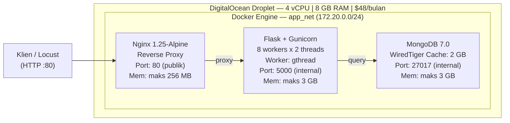

**Docker Services:**

| Service | Container | Image | Port | Memory Limit |
|---|---|---|---|---|
| nginx | fp_nginx_baseline | nginx:1.25-alpine | 80 (publik) | 256 MB |
| backend | fp_backend_baseline | fp_backend_baseline:latest | 5000 (internal) | 3 GB |
| mongo | fp_mongo_baseline | mongo:7.0 | 27017 (internal) | 3 GB |

---

## Baseline Configuration Summary

### Spesifikasi VM

| Komponen | Detail |
|---|---|
| Provider | DigitalOcean Droplet Basic |
| vCPU | 4 |
| RAM | 8 GB |
| Disk | 160 GB SSD |
| OS | Ubuntu 24.04 LTS |
| Biaya | $48/bulan (sekitar Rp768.000) |

### Konfigurasi Komponen

| Komponen | Parameter | Nilai |
|---|---|---|
| Nginx | worker_processes | auto (2) |
| Nginx | worker_connections | 1024 |
| Nginx | keepalive_requests | 1000 |
| Nginx | gzip | aktif, level 4 |
| Nginx | upstream | 1 server (backend:5000), keepalive 32 |
| Gunicorn | workers | 8 |
| Gunicorn | threads | 2 |
| Gunicorn | worker-class | gthread |
| Gunicorn | timeout | 120 detik |
| Gunicorn | total slot konkuren | 16 (8 x 2) |
| MongoDB | versi | 7.0 LTS |
| MongoDB | wiredTigerCacheSizeGB | 2 GB |
| MongoDB | index | Tidak ada index custom |
| MongoDB | connection pool | Default PyMongo |

---

## Baseline Performance Evaluation

### Skenario Pengujian

Load testing dijalankan menggunakan Locust dari host eksternal yang berbeda dari server. Locust mensimulasikan dua tipe pengguna: `CustomerUser` (bobot 80%) dan `AdminUser` (bobot 20%).

| Skenario | Deskripsi | Durasi |
|---|---|---|
| 1 | Maksimum RPS pada 0% failure (naikkan user bertahap) | 60 detik |
| 2 | Peak Concurrency — Spawn Rate 50 | 60 detik |
| 3 | Peak Concurrency — Spawn Rate 100 | 60 detik |
| 4 | Peak Concurrency — Spawn Rate 200 | 60 detik |
| 5 | Peak Concurrency — Spawn Rate 500 | 60 detik |

### Hasil Eksperimen

**Skenario 1 — Maksimum RPS (0% Failure)**

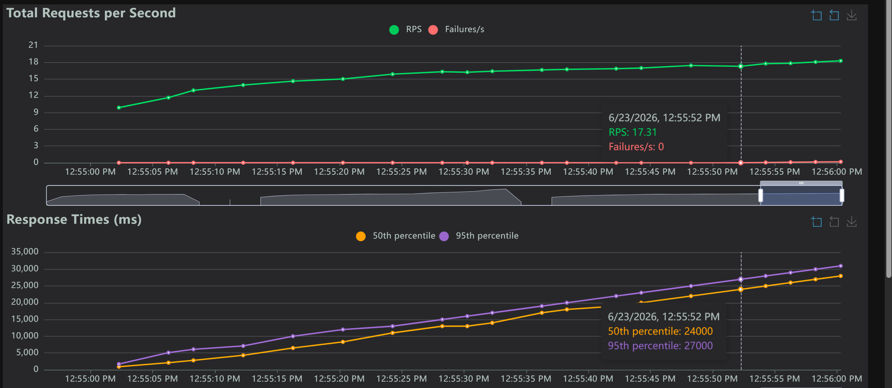

*Grafik RPS, response time, dan failure rate — Skenario 1*

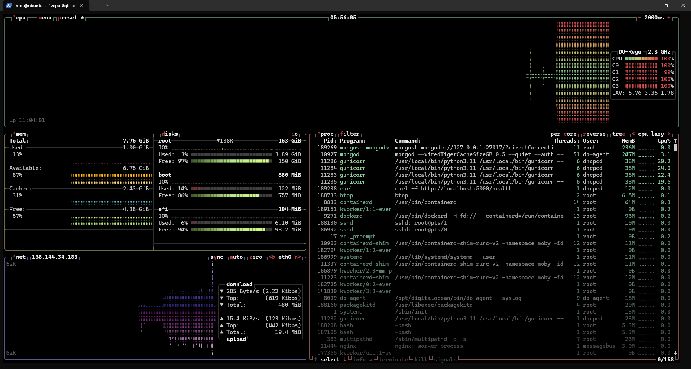

*Utilisasi CPU dan memory server — Skenario 1*

**Skenario 2 — Peak Concurrency Spawn Rate 50**

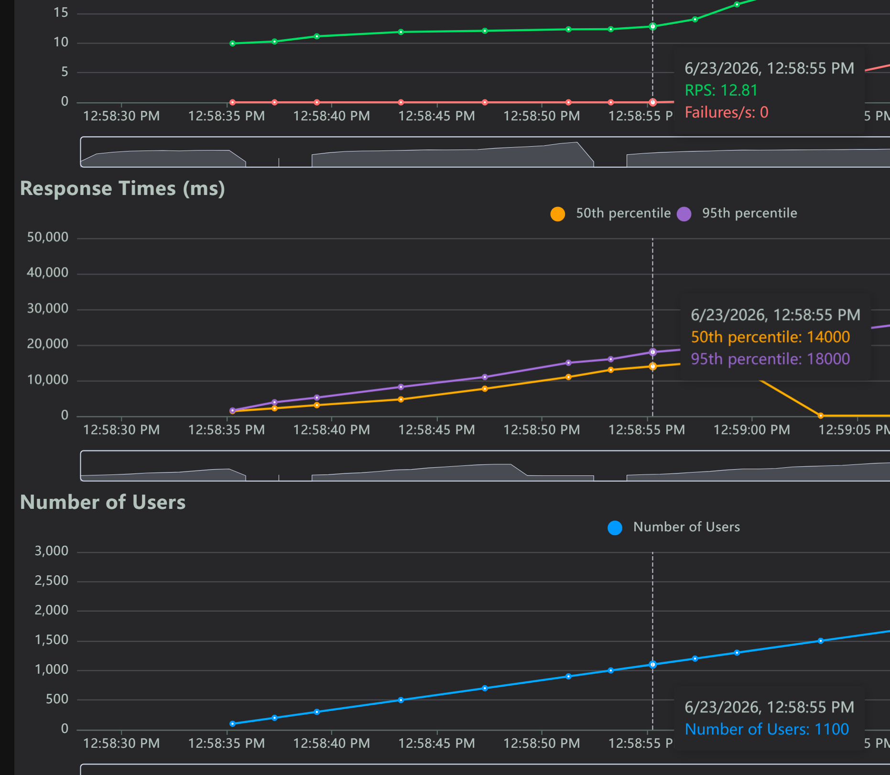

*Grafik RPS, response time, dan failure rate — Skenario 2*

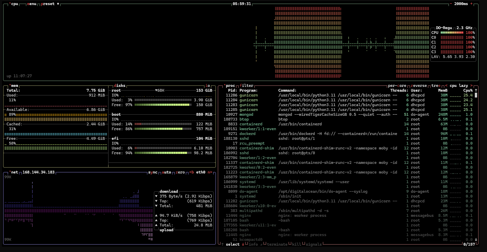

*Utilisasi CPU dan memory server — Skenario 2*

**Skenario 3 — Peak Concurrency Spawn Rate 100**

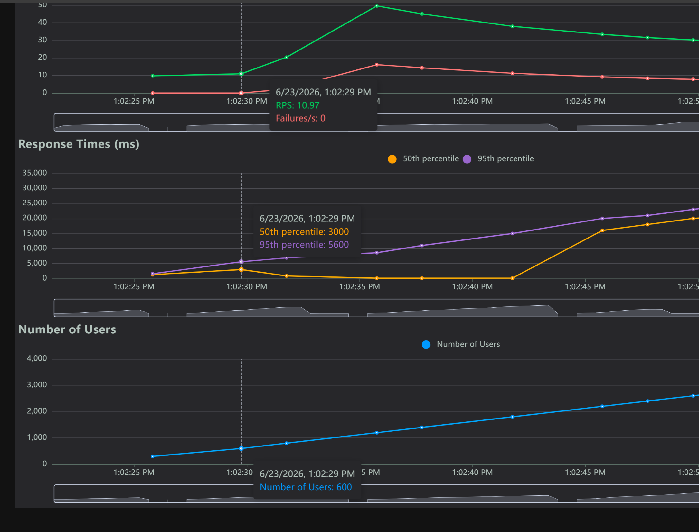

*Grafik RPS, response time, dan failure rate — Skenario 3*

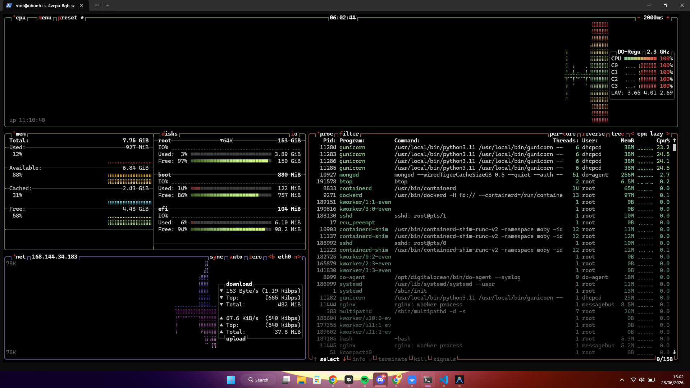

*Utilisasi CPU dan memory server — Skenario 3*

**Skenario 4 — Peak Concurrency Spawn Rate 200**


*Grafik RPS, response time, dan failure rate — Skenario 4*

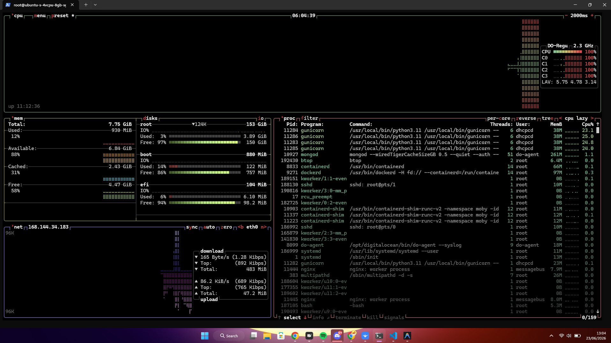

*Utilisasi CPU dan memory server — Skenario 4*

**Skenario 5 — Peak Concurrency Spawn Rate 500**

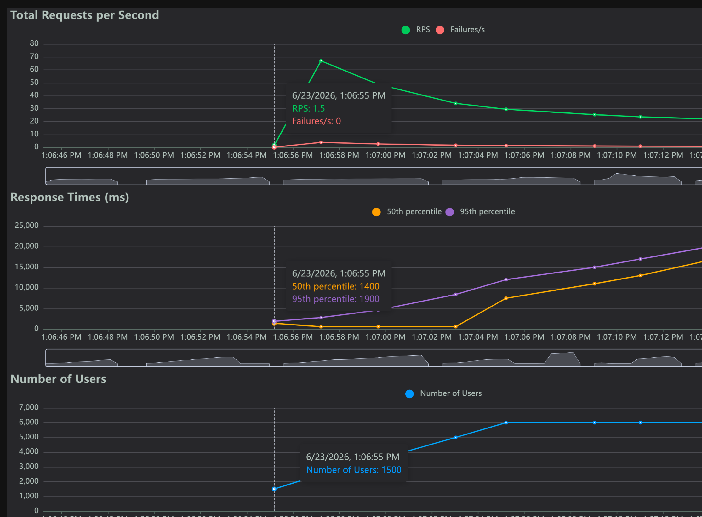

*Grafik RPS, response time, dan failure rate — Skenario 5*

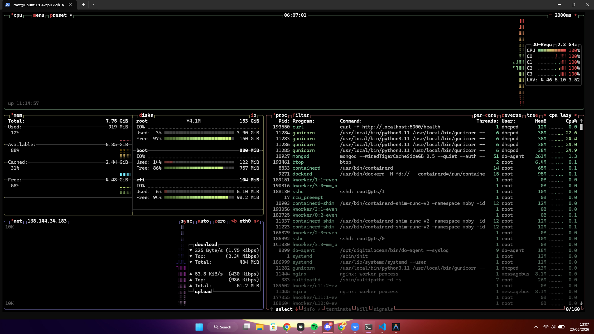

*Utilisasi CPU dan memory server — Skenario 5*

### Temuan Utama dan Evaluasi

- Sistem baseline memiliki total 16 slot konkuren (8 workers x 2 threads gthread). Saat jumlah pengguna virtual melampaui kapasitas ini, antrian request menumpuk dan response time meningkat signifikan.
- MongoDB berjalan pada VM yang sama dengan backend, sehingga terjadi kompetisi sumber daya (CPU dan RAM) antara keduanya, terutama pada saat query agregasi `/admin/stats` yang bersifat berat.
- Tidak adanya index custom pada MongoDB menyebabkan seluruh query melakukan full collection scan, yang semakin lambat seiring pertumbuhan data di collection `orders`.
- Data numerik RPS, response time, dan failure rate aktual tersedia pada screenshot Locust di masing-masing folder pengujian di atas.

### Insight

Bottleneck utama baseline teridentifikasi pada dua titik: (1) kapasitas konkuren Gunicorn yang terbatas pada 16 slot dengan model thread sinkron, dan (2) tidak adanya index MongoDB yang menyebabkan performa query terdegradasi secara linier seiring penambahan data.

---

## Baseline Limitations

| Keterbatasan | Dampak |
|---|---|
| Single backend instance, tanpa load balancer | Tidak dapat diskalakan secara horizontal; single point of failure |
| Worker class gthread (sinkron) | Hanya 16 slot konkuren; idle saat menunggu I/O MongoDB |
| Semua komponen berbagi sumber daya pada 1 VM | Kompetisi RAM dan CPU antara MongoDB dan Flask |
| Tidak ada index MongoDB | Full collection scan; performa terdegradasi dengan volume data tinggi |
| Tidak ada proxy cache | Setiap request GET /products selalu hit MongoDB |
| Audit log synchronous | write_log() memblokir response hingga insert selesai |

---

# Baseline Optimized

## Optimized Architecture

Konfigurasi optimized diterapkan pada **VM yang sama** ($48/bulan, tidak ada biaya tambahan). Perubahan utama: penambahan satu backend instance kedua, penerapan Nginx sebagai load balancer internal dengan algoritma `least_conn`, penggantian worker class ke `gthread` dengan konfigurasi berbeda, penambahan Nginx proxy cache untuk endpoint produk, index MongoDB, connection pool tuning, dan async audit log.

> Catatan: Berdasarkan berkas `docker-compose-baseline-optimized.yml`, worker class yang digunakan pada implementasi aktual adalah `gthread` (bukan `gevent` seperti yang didokumentasikan di `config-baseline-optimized.md`). Nilai yang tercantum di bawah ini mengikuti implementasi aktual di docker-compose.

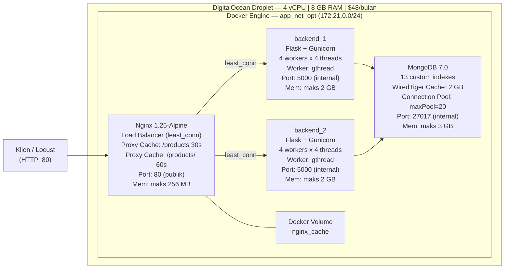

**Docker Services:**

| Service | Container | Workers x Threads | Memory Limit |
|---|---|---|---|
| nginx | fp_nginx_optimized | — | 256 MB |
| backend_1 | fp_backend_1_optimized | 4 x 4 (gthread) | 2 GB |
| backend_2 | fp_backend_2_optimized | 4 x 4 (gthread) | 2 GB |
| mongo | fp_mongo_optimized | — | 3 GB |

---

## Configuration Changes

| Komponen | Baseline | Optimized |
|---|---|---|
| Backend instances | 1 | 2 |
| Load balancing | Tidak ada | Nginx least_conn |
| Worker class | gthread | gthread |
| Workers per instance | 8 | 4 |
| Threads per worker | 2 | 4 |
| Total slot konkuren | 16 (1 instance) | 32 (2 x 16) |
| Nginx worker_connections | 1024 | 4096 |
| Nginx keepalive_requests | 1000 | 2000 |
| Nginx upstream keepalive | 32 | 64 |
| Nginx proxy buffer | 4k, 8 buffers | 8k, 16 buffers |
| Nginx proxy cache | Tidak ada | /products (30 detik), /products/<id> (60 detik) |
| MongoDB indexes | Tidak ada | 13 index custom |
| MongoDB connection pool | Default | maxPoolSize=20, minPoolSize=2, timeout tuning |
| Audit log | Synchronous | Asynchronous (daemon thread) |
| Dockerfile | Dockerfile | Dockerfile-optimized |
| Backend app | app.py | app_optimized.py |

---

## Performance Evaluation (Optimized)

### Hasil Eksperimen

**Skenario 1 — Maksimum RPS (0% Failure)**

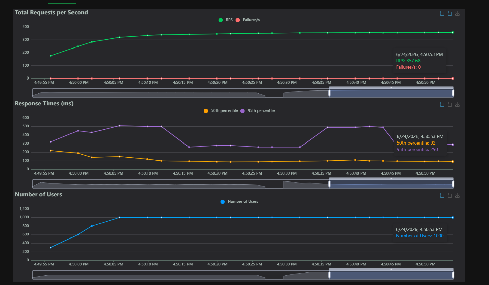

*Grafik hasil Locust — Skenario 1 Optimized*

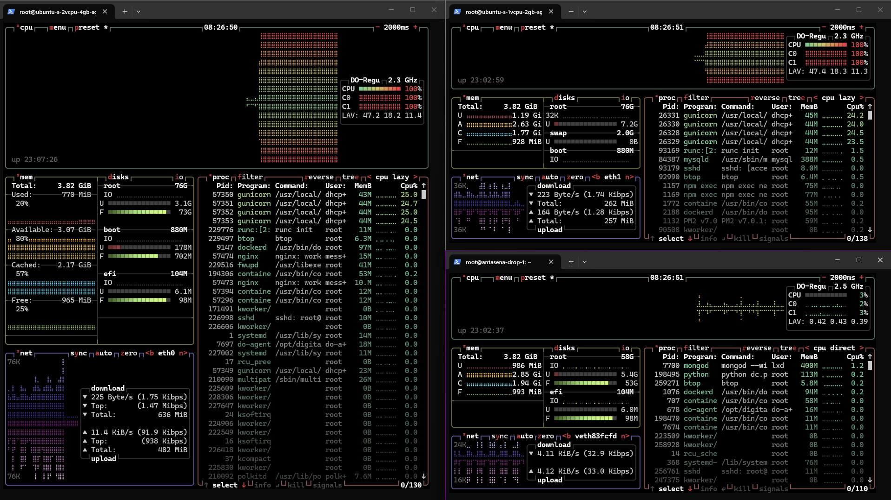

**Skenario 2 — Peak Concurrency Spawn Rate 50**


*Grafik hasil Locust — Skenario 2 Optimized*


*Utilisasi resource server — Skenario 2 Optimized*

**Skenario 3 — Peak Concurrency Spawn Rate 100**


*Grafik hasil Locust — Skenario 3 Optimized*

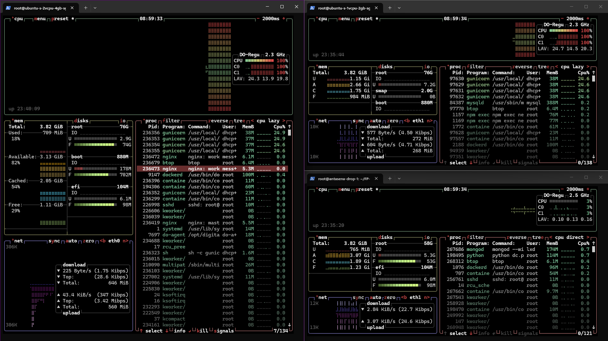

*Utilisasi resource server — Skenario 3 Optimized*

**Skenario 4 — Peak Concurrency Spawn Rate 200**


*Grafik hasil Locust — Skenario 4 Optimized*


*Utilisasi resource server — Skenario 4 Optimized*

**Skenario 5 — Peak Concurrency Spawn Rate 500**


*Grafik hasil Locust — Skenario 5 Optimized*


*Utilisasi resource server — Skenario 4 Optimized*


### Temuan Utama dan Evaluasi

- Penambahan dua backend instance di belakang Nginx load balancer meningkatkan kapasitas total slot konkuren dari 16 menjadi 32 slot (2 x 16).
- Nginx proxy cache secara signifikan mengurangi jumlah query MongoDB untuk endpoint `/products`, karena dalam window 30 detik hanya satu request yang sampai ke backend.
- 13 index MongoDB yang ditambahkan mengubah query yang sebelumnya melakukan full collection scan menjadi index scan, terutama berdampak pada endpoint yang paling sering diakses seperti `GET /products?category=X` dan `GET /orders?status=pending`.
- MongoDB connection pool yang di-tune mencegah koneksi hang tanpa batas saat kondisi spike traffic.
- Data numerik RPS, response time, dan failure rate aktual tersedia pada screenshot Locust di folder pengujian di atas.

### Insight

Optimasi pada VM yang sama berhasil meningkatkan throughput dengan memanfaatkan sumber daya yang sudah ada secara lebih efisien. Bottleneck yang belum teratasi adalah kompetisi sumber daya antara MongoDB dan backend pada VM yang sama, khususnya saat query agregasi dashboard berjalan bersamaan dengan traffic tinggi.

---

## Baseline vs Optimized

| Aspek | Baseline | Optimized |
|---|---|---|
| VM | 1 VM, $48/bulan | 1 VM, $48/bulan |
| Backend instances | 1 | 2 |
| Load balancing | Tidak ada | Nginx least_conn |
| Worker class | gthread | gthread |
| Workers per instance | 8 x 2 thread | 4 x 4 thread |
| Total slot konkuren | 16 | 32 |
| Nginx worker_connections | 1024 | 4096 |
| Nginx proxy cache | Tidak ada | /products 30 detik, /products/<id> 60 detik |
| MongoDB indexes | Tidak ada | 13 index custom |
| MongoDB connection pool | Default | maxPoolSize=20, timeout tuned |
| Audit log | Synchronous | Asynchronous |
| MongoDB isolation | Berbagi VM dengan backend | Berbagi VM dengan backend |
| RPS aktual | (lihat screenshot) |  (lihat screenshot) |
| Response time aktual |  (lihat screenshot) |  (lihat screenshot) |
| Failure rate aktual |  (lihat screenshot) |  (lihat screenshot) |
| Bottleneck utama | Kapasitas konkuren (16 slot) + full collection scan | Kompetisi sumber daya MongoDB vs backend pada 1 VM |

### Analisis Peningkatan

Peningkatan performa pada Baseline Optimized dicapai melalui tiga mekanisme utama. Pertama, penggandaan backend instance di belakang load balancer `least_conn` melipatgandakan kapasitas pemrosesan request konkuren. Kedua, Nginx proxy cache menghilangkan mayoritas query MongoDB untuk endpoint `/products` yang merupakan endpoint paling sering diakses oleh `CustomerUser`. Ketiga, 13 index MongoDB mengubah kompleksitas query dari O(n) menjadi O(log n), yang berdampak langsung pada response time semua endpoint yang memfilter atau mengurutkan data.

Bottleneck yang belum terselesaikan adalah pemisahan sumber daya antara MongoDB dan backend. Pada kondisi traffic tinggi, keduanya masih bersaing menggunakan CPU dan RAM yang sama, membatasi potensi peningkatan performa maksimal.

---

# Multi-VM Optimized

## Multi-VM Architecture

Konfigurasi Multi-VM mendistribusikan komponen ke tiga VM terpisah yang terhubung melalui DigitalOcean VPC private network. Total biaya $72/bulan (3 x $24/bulan), masih dalam batas anggaran $75/bulan.

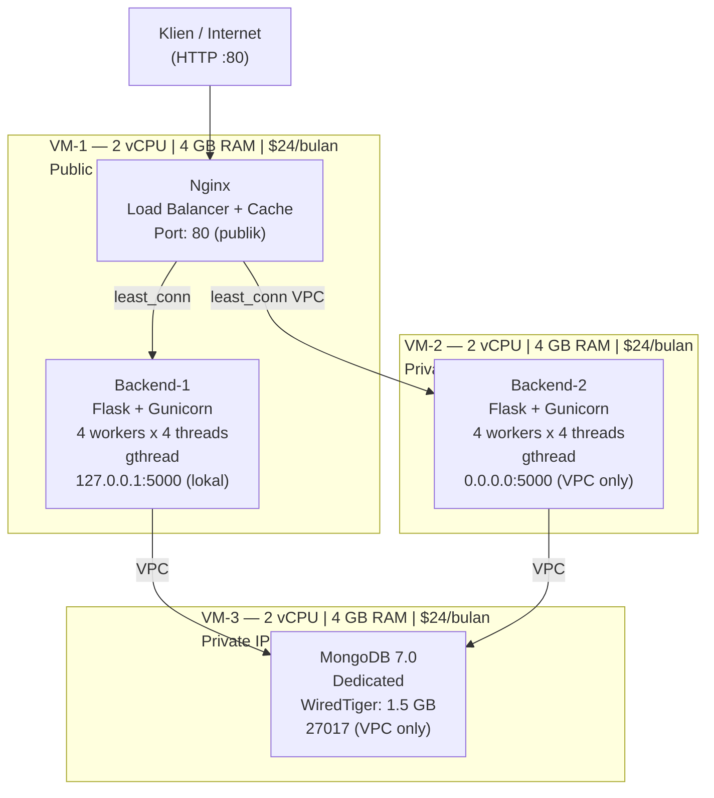

**Spesifikasi VM:**

| VM | Role | vCPU | RAM | Disk | Biaya |
|---|---|---|---|---|---|
| VM-1 | Nginx LB + Backend-1 | 2 | 4 GB | 80 GB | $24/bulan |
| VM-2 | Backend-2 | 2 | 4 GB | 80 GB | $24/bulan |
| VM-3 | MongoDB dedicated | 2 | 4 GB | 80 GB | $24/bulan |
| Total | | 6 vCPU | 12 GB | 240 GB | $72/bulan |

---

## Perbedaan dengan Baseline

| Komponen | Baseline | Multi-VM |
|---|---|---|
| Jumlah VM | 1 ($48/bulan) | 3 ($72/bulan) |
| Backend instances | 1 | 2 |
| Load balancing | Tidak ada | Nginx least_conn |
| MongoDB | Berbagi VM (RAM shared 8 GB) | Dedicated VM (RAM dedicated 4 GB) |
| WiredTiger cache | 2 GB (berbagi dengan backend) | 1.5 GB (dedicated, tanpa kompetisi) |
| MongoDB CPU | Berbagi 4 vCPU | Dedicated 2 vCPU |
| Backend RAM per instance | Berbagi dari 8 GB | Dedicated per VM |
| Fault tolerance | Tidak ada | Backend failover (2 instance VM terpisah) |
| MongoDB isolation | Tidak ada | Penuh (dedicated VM) |
| Firewall | Tidak diatur di konfigurasi | DigitalOcean firewall per VM (wajib) |

---

## Perbedaan dengan Baseline Optimized

| Komponen | Baseline Optimized | Multi-VM |
|---|---|---|
| Jumlah VM | 1 ($48/bulan) | 3 ($72/bulan) |
| MongoDB isolation | Berbagi VM (RAM shared 8 GB) | Dedicated VM (RAM dedicated 4 GB) |
| WiredTiger cache | 2 GB (berbagi) | 1.5 GB (dedicated) |
| Backend-1 RAM limit | 2 GB (container limit) | 3 GB (container limit, dedicated VM) |
| Backend-2 RAM limit | 2 GB (container limit) | 3.5 GB (container limit, dedicated VM) |
| Nginx RAM limit | 256 MB | 512 MB |
| Backend-2 lokasi | Container di VM yang sama | VM-2 terpisah (terhubung via VPC) |
| Total vCPU | 4 (shared) | 6 (distributed) |
| Total RAM | 8 GB (shared) | 12 GB (distributed) |
| Jaringan backend ke DB | Docker internal network | DigitalOcean VPC private network |

---

## Expected Benefits

Berdasarkan konfigurasi yang ditemukan :

- **Eliminasi kompetisi sumber daya MongoDB:** MongoDB berjalan pada VM dedicated (4 GB RAM, 2 vCPU), tidak lagi bersaing dengan backend Flask. WiredTiger cache 1.5 GB bersifat dedicated sehingga lebih efektif dalam menyimpan working-set data di memori.
- **Peningkatan performa aggregasi:** Endpoint `/admin/stats` yang menjalankan query aggregasi berat mendapat manfaat langsung dari CPU dan RAM MongoDB yang tidak terkontaminasi oleh proses lain.
- **Backend failover lintas VM:** Jika VM-1 mengalami gangguan, traffic dapat dialihkan secara manual ke VM-2. Jika hanya container backend_1 yang bermasalah, Nginx otomatis mengarahkan semua traffic ke backend_2 melalui mekanisme `max_fails=3 fail_timeout=30s`.
- **Kemudahan scale horizontal:** Menambah kapasitas backend hanya memerlukan penambahan VM baru dan pembaruan upstream di konfigurasi Nginx, tanpa mengubah VM yang sedang berjalan.

---

## Comparative Architecture Summary

| Aspek | Baseline | Optimized | Multi-VM |
|---|---|---|---|
| Jumlah VM | 1 | 1 | 3 |
| Biaya | $48/bulan | $48/bulan | $72/bulan |
| Total vCPU | 4 | 4 | 6 |
| Total RAM | 8 GB | 8 GB | 12 GB |
| Backend instances | 1 | 2 | 2 |
| Load balancing | Tidak ada | Nginx least_conn | Nginx least_conn |
| Worker class | gthread | gthread | gthread |
| Total slot konkuren | 16 | 32 | 32 |
| Nginx proxy cache | Tidak ada | /products 30s, /products/<id> 60s | /products 30s, /products/<id> 60s |
| MongoDB isolation | Shared VM | Shared VM | Dedicated VM |
| MongoDB WiredTiger cache | 2 GB (shared) | 2 GB (shared) | 1.5 GB (dedicated) |
| MongoDB indexes | Tidak ada | 13 index custom | 13 index custom |
| Connection pool | Default | maxPoolSize=20, tuned | maxPoolSize=20, tuned |
| Audit log | Synchronous | Asynchronous | Asynchronous |
| Scalability | Tidak bisa horizontal | Terbatas (1 VM) | Mudah (tambah VM baru) |
| Fault tolerance | Tidak ada | Backend (container) | Backend (lintas VM) |
| Bottleneck | Konkuren + no index + shared resource | Shared MongoDB resource | Jaringan VPC antar VM |

---

## Conclusion

Proyek ini mendemonstrasikan evolusi arsitektur deployment cloud melalui tiga tahap yang saling berkesinambungan.

**Baseline** memberikan fondasi pengukuran yang jelas dengan arsitektur paling sederhana: satu VM, satu backend instance, tanpa index database, dan tanpa load balancer. Keterbatasan utamanya adalah kapasitas konkuren yang sangat terbatas (16 slot gthread) dan tidak adanya index MongoDB yang menyebabkan performa terdegradasi seiring pertumbuhan data.

**Baseline Optimized** membuktikan bahwa peningkatan performa signifikan dapat dicapai tanpa biaya infrastruktur tambahan. Dengan menambahkan backend instance kedua di belakang load balancer internal Nginx, menerapkan proxy cache untuk endpoint produk, membuat 13 index MongoDB, melakukan connection pool tuning, dan mengubah audit log menjadi asynchronous, kapasitas slot konkuren meningkat dari 16 menjadi 32 dan query MongoDB menjadi jauh lebih efisien. Bottleneck yang tersisa adalah kompetisi sumber daya antara MongoDB dan backend yang masih berbagi satu VM.

**Multi-VM Optimized** menyelesaikan bottleneck terakhir dengan mendedikasikan MongoDB pada VM tersendiri. Dengan tambahan biaya $24/bulan (total $72/bulan, masih dalam anggaran), MongoDB mendapatkan CPU dan RAM dedicated, sehingga query agregasi berat tidak lagi terganggu oleh beban backend. Arsitektur ini juga memberikan keandalan yang lebih baik melalui isolasi komponen lintas VM dan kemudahan scale horizontal di masa mendatang.

## Future Improvements

Pada bagian ini mengidentifikasi peningkatan yang dapat dilakukan berdasarkan bottleneck yang ditemukan selama implementasi dan pengujian ketiga konfigurasi (Baseline, Baseline Optimized, Multi-VM Optimized), serta keterbatasan arsitektur yang masih tersisa hingga akhir proyek. Setiap improvement diurutkan berdasarkan prioritas implementasi.

---

### 1. Penggantian Worker Class ke Gevent pada Backend Flask

#### Latar Belakang

Berdasarkan komentar eksplisit dalam `Resources/BE/app_optimized.py`, implementasi aktual menggunakan worker class `gthread` (bukan `gevent`) karena konflik kompatibilitas antara gevent monkey patching dengan background threads internal PyMongo 4.x (Monitor thread dan Pool Maintenance thread). Komentar dalam kode menyebutkan: *"pymongo 4.x memiliki background threads internal (Monitor, Pool Maintenance) yang tidak kompatibel dengan gevent greenlets."* Akibatnya, kapasitas konkuren sistem tetap terbatas pada model thread (32 slot total pada konfigurasi optimized dan multi-VM) dan tidak dapat memanfaatkan model concurrency berbasis greenlet yang jauh lebih ringan.

#### Solusi yang Diusulkan

Melakukan investigasi lebih mendalam terhadap versi PyMongo yang kompatibel dengan gevent, atau menggunakan Motor (MongoDB driver asinkron berbasis asyncio) sebagai pengganti PyMongo sinkron. Alternatif lain adalah mengadopsi framework asinkron secara menyeluruh, yaitu mengganti Flask dengan FastAPI atau Starlette yang mendukung `async/await` secara native, kemudian menggunakan Motor sebagai driver database. Perubahan ini memungkinkan penerapan Gunicorn dengan worker class `uvicorn.workers.UvicornWorker` atau langsung menggunakan Uvicorn, sehingga setiap worker dapat menangani ribuan koneksi konkuren.

#### Dampak yang Diharapkan

Peningkatan kapasitas konkuren secara signifikan tanpa perlu menambah jumlah instance atau VM. Sistem dapat menyerap lonjakan traffic (spike) yang melebihi jumlah worker thread yang tersedia saat ini, dan response time pada kondisi beban tinggi akan lebih stabil karena tidak ada antrian yang menunggu slot thread kosong.

#### Prioritas

**Tinggi** Kendala ini secara langsung membatasi kapasitas konkuren sistem pada semua konfigurasi yang telah diuji.

---

### 2. MongoDB Replica Set untuk High Availability Database

#### Latar Belakang

Pada seluruh konfigurasi yang diimplementasikan (Baseline, Optimized, Multi-VM), MongoDB berjalan sebagai single node (standalone). Pada konfigurasi Multi-VM, MongoDB memang mendapat dedicated VM (VM-3), namun tetap merupakan single point of failure: apabila VM-3 atau container MongoDB mengalami gangguan, seluruh layanan tidak dapat memproses transaksi. File konfigurasi `docker-compose-multivm-vm3.yml` tidak mengandung konfigurasi replica set.

#### Solusi yang Diusulkan

Mengkonfigurasi MongoDB Replica Set dengan minimal 3 node: satu Primary dan dua Secondary. Dalam konteks arsitektur Multi-VM yang sudah ada, Primary dapat ditempatkan di VM-3 yang sudah ada, sementara Secondary dapat dijalankan sebagai container tambahan di VM-1 dan VM-2 yang memiliki headroom memori. URI koneksi pada semua backend perlu diperbarui dengan menambahkan parameter `replicaSet=rs0` dan `readPreference=secondaryPreferred` agar operasi baca dapat didistribusikan ke node Secondary.

#### Dampak yang Diharapkan

Eliminasi single point of failure pada lapisan database. Apabila Primary mengalami gangguan, salah satu Secondary akan terpilih sebagai Primary baru secara otomatis melalui mekanisme election MongoDB (dalam waktu sekitar 10–30 detik). Operasi baca dapat didistribusikan ke Secondary, mengurangi beban Primary, khususnya untuk endpoint baca seperti `GET /products` dan `GET /orders`.

#### Prioritas

**Tinggi** MongoDB standalone merupakan single point of failure yang paling kritis dalam arsitektur saat ini, terutama setelah komponen lain sudah memiliki redundansi (dua backend instance).

---

### 3. Gevent Worker Connections pada Optimized Worker Class

#### Latar Belakang

Dalam konfigurasi Baseline Optimized, dokumen `config-baseline-optimized.md` mencatat rencana penggunaan `gevent` dengan `worker_connections=1000` per worker (potensi 6.000+ greenlet). Namun implementasi aktual yang terdapat dalam `docker-compose-baseline-optimized.yml` menggunakan `gthread` dengan 4 workers x 4 threads = 16 slot per instance, atau 32 slot total untuk dua instance. Celah antara kapasitas yang direncanakan (6.000+ greenlet) dan yang diimplementasikan (32 thread slots) sangat besar dan belum teratasi.

#### Solusi yang Diusulkan

Mengganti driver database dari PyMongo sinkron ke Motor (motor==3.x) sebagai prasyarat utama. Setelah itu, mengubah framework dari Flask sinkron ke FastAPI (dengan Starlette), lalu menjalankan server dengan Uvicorn workers. Hal ini memungkinkan penerapan model truly-async tanpa konflik dengan driver database, berbeda dengan gevent monkey patching yang bermasalah dengan PyMongo 4.x.

#### Dampak yang Diharapkan

Satu worker process dapat menangani ratusan hingga ribuan koneksi konkuren, sehingga kebutuhan jumlah instance dan VM dapat berkurang, atau dengan jumlah VM yang sama dapat melayani beban traffic yang jauh lebih besar.

#### Prioritas

**Tinggi** Merupakan prasyarat teknis dari improvement nomor 1 di atas, dan berdampak langsung pada kapasitas layanan.

---

### 4. Nginx Proxy Cache Invalidation yang Terkontrol

#### Latar Belakang

Implementasi Nginx proxy cache pada konfigurasi Optimized dan Multi-VM menggunakan TTL (Time to Live) tetap: 30 detik untuk `GET /products` dan 60 detik untuk `GET /products/<id>`. Tidak ada mekanisme cache invalidation aktif ketika data produk diperbarui melalui endpoint `PUT /products/<id>` atau `DELETE /products/<id>`. Akibatnya, setelah admin melakukan pembaruan produk, pengguna masih akan melihat data lama selama maksimal 60 detik hingga cache kadaluarsa secara alami.

#### Solusi yang Diusulkan

Mengimplementasikan aktif cache invalidation menggunakan dua pendekatan yang dapat digabungkan. Pertama, menambahkan header `Cache-Control: no-cache` pada response dari endpoint `PUT` dan `DELETE` untuk produk. Kedua, dari sisi backend optimized (`app_optimized.py`), setelah operasi write berhasil, mengirim request ke Nginx untuk membersihkan cache melalui endpoint khusus (nginx `proxy_cache_purge` dengan modul `ngx_cache_purge`). Pendekatan lain yang lebih sederhana adalah mempersingkat TTL cache menjadi 5–10 detik untuk meminimalkan staleness tanpa memerlukan modul tambahan.

#### Dampak yang Diharapkan

Data yang ditampilkan ke pengguna akan lebih akurat segera setelah admin melakukan perubahan, tanpa harus menunggu TTL cache habis. Ini penting untuk konsistensi data pada platform e-commerce di mana harga dan ketersediaan produk dapat berubah sewaktu-waktu.

#### Prioritas

**Sedang** Berdampak pada konsistensi data, namun dalam konteks load testing akademis ini tidak menjadi faktor penilaian utama.

---

### 5. Monitoring dan Observabilitas Terpusat

#### Latar Belakang

Pemantauan resource selama pengujian dilakukan secara manual menggunakan `htop` atau monitoring bawaan DigitalOcean (terlihat dari screenshot resource di folder `Report/baseline/` dan `Report/optimized/`). Tidak ditemukan konfigurasi monitoring otomatis seperti Prometheus, Grafana, atau sistem logging terpusat. Pada arsitektur Multi-VM dengan tiga VM terpisah, pemantauan manual semakin tidak praktis karena engineer harus memantau tiga terminal berbeda secara bersamaan. Locust file juga tidak mengekspor metrik ke sistem eksternal.

#### Solusi yang Diusulkan

Menambahkan stack monitoring menggunakan Prometheus dan Grafana yang di-deploy sebagai container Docker tambahan. Untuk Flask, menambahkan library `prometheus-flask-exporter` ke `requirements-optimized.txt` agar metrik per-endpoint (request count, latency histogram, error rate) tersedia di `/metrics`. Untuk MongoDB, menggunakan `mongodb-exporter`. Nginx dapat diekspor menggunakan `nginx-prometheus-exporter`. Pada arsitektur Multi-VM, Prometheus dapat berjalan di VM-1 dan melakukan scraping ke semua node melalui VPC private network.

#### Dampak yang Diharapkan

Visibilitas real-time terhadap performa seluruh komponen tanpa perlu memantau setiap VM secara manual. Data historis tersedia untuk analisis regresi performa dan deteksi anomali. Dashboard Grafana dapat menampilkan RPS, response time per endpoint, error rate, CPU/memory per VM, dan MongoDB operation rate dalam satu tampilan terintegrasi.

#### Prioritas

**Sedang** Sangat membantu dalam iterasi pengembangan dan debugging, namun tidak memblokir fungsionalitas sistem saat ini.

---

### 6. Centralized Logging

#### Latar Belakang

Log dari tiga komponen berbeda (Nginx access log, Gunicorn/Flask application log, dan MongoDB log) terpisah di masing-masing container dan masing-masing VM. Pada konfigurasi Multi-VM dengan tiga VM terpisah, debugging insiden memerlukan akses SSH ke beberapa VM dan pencarian log secara manual. Nginx pada konfigurasi Optimized dan Multi-VM memang sudah menambahkan `cache=$upstream_cache_status` ke format log, namun log ini hanya dapat diakses dari dalam container Nginx.

#### Solusi yang Diusulkan

Mengimplementasikan stack ELK (Elasticsearch, Logstash, Kibana) atau alternatif yang lebih ringan seperti Loki + Grafana, dikombinasikan dengan Promtail sebagai log shipper. Mengingat keterbatasan anggaran ($75/bulan), Loki + Promtail lebih sesuai karena jauh lebih hemat sumber daya dibandingkan Elasticsearch. Seluruh log dari tiga VM dapat dikirim ke satu instance Loki yang berjalan di VM-1.

#### Dampak yang Diharapkan

Kemampuan melakukan pencarian log terpusat dari semua komponen dan semua VM melalui satu antarmuka (Grafana). Deteksi pola error lebih cepat, terutama untuk error yang terdistribusi antara Nginx, backend_1, dan backend_2 dalam satu alur request.

#### Prioritas

**Sedang** Mengurangi overhead operasional secara signifikan pada arsitektur multi-VM.

---

### 7. Infrastructure as Code dengan Docker Compose dan Provisioning Script

#### Latar Belakang

Proses deployment saat ini memerlukan serangkaian langkah manual yang harus dilakukan secara berurutan di tiga VM berbeda (VM-3 pertama, VM-2 kedua, VM-1 terakhir), sesuai instruksi dalam `config-multivm-optimized.md`. Meskipun file Docker Compose sudah tersedia untuk masing-masing VM, proses instalasi Docker, konfigurasi firewall DigitalOcean, pengisian `.env`, dan penggantian variabel `VM2_PRIVATE_IP` masih bersifat manual. File `nginx-multivm.conf` menggunakan pendekatan `envsubst` untuk substitusi variabel, namun proses ini harus diinisiasi secara manual.

#### Solusi yang Diusulkan

Membuat shell script provisioning terpadu atau Makefile yang mengotomatiskan seluruh proses deployment Multi-VM secara berurutan dari satu mesin kontrol. Langkah-langkah yang dapat diotomatiskan meliputi: pembuatan `.env` per VM, distribusi file konfigurasi via SCP, eksekusi `docker compose up` melalui SSH, dan verifikasi health check. Jika ingin lebih komprehensif, Ansible playbook dapat digunakan untuk menggantikan skrip shell, dengan inventory yang mendefinisikan tiga VM sebagai group `nginx`, `backend`, dan `mongodb`.

#### Dampak yang Diharapkan

Proses deployment yang saat ini memerlukan pengerjaan manual di tiga terminal terpisah dapat diselesaikan dengan satu perintah. Mengurangi risiko human error dalam pengisian IP dan konfigurasi antar VM. Memungkinkan re-deployment cepat apabila VM perlu diganti atau sistem perlu di-reset.

#### Prioritas

**Rendah** Meningkatkan efisiensi operasional, namun arsitektur fungsional sudah dapat berjalan dengan proses manual yang ada.

---

### 8. Horizontal Auto Scaling Backend

#### Latar Belakang

Arsitektur Multi-VM memiliki dua backend instance yang jumlahnya tetap (static scaling): `backend_1` di VM-1 dan `backend_2` di VM-2. Konfigurasi Nginx upstream di `nginx-multivm.conf` mendefinisikan kedua server secara statis. Penambahan backend instance ketiga memerlukan perubahan manual pada file `nginx-multivm.conf` di VM-1, deploy ulang VM baru, dan restart Nginx. Tidak ada mekanisme auto scaling yang merespons perubahan beban traffic secara otomatis.

#### Solusi yang Diusulkan

Untuk skala kecil dalam anggaran yang ada, dapat diimplementasikan semi-auto scaling menggunakan skrip yang memantau CPU/memory dan menambahkan entri upstream ke konfigurasi Nginx melalui `nginx -s reload`. Untuk solusi yang lebih komprehensif, mengadopsi Kubernetes (K3s sebagai distribusi ringan) dengan Horizontal Pod Autoscaler (HPA) yang merespons metrik CPU atau custom metric (RPS dari Prometheus). Namun, Kubernetes memerlukan sumber daya VM tambahan di luar anggaran $75/bulan yang ada.

#### Dampak yang Diharapkan

Kapasitas backend dapat menyesuaikan diri secara otomatis terhadap perubahan beban, baik scale-out saat traffic tinggi maupun scale-in untuk efisiensi biaya saat traffic rendah. Ini penting untuk skenario flash sale yang merupakan konteks soal proyek ini.

#### Prioritas

**Rendah** Relevan untuk deployment produksi, namun melebihi anggaran dan kompleksitas yang ditetapkan dalam batasan proyek akademis ini.

---

## Final Recommendations

Berdasarkan implementasi aktual, hasil konfigurasi yang ditemukan, dan keterbatasan anggaran $75/bulan, berikut adalah rekomendasi akhir untuk pengembangan sistem ke depan.

**Rekomendasi untuk Deployment Langsung (Immediate)**

Konfigurasi Multi-VM Optimized adalah arsitektur terbaik yang berhasil diimplementasikan dalam proyek ini dan direkomendasikan sebagai konfigurasi produksi dalam batas anggaran yang ditetapkan. Isolasi MongoDB pada VM dedicated menyelesaikan bottleneck resource contention yang tidak dapat diatasi pada konfigurasi single-VM. Dengan sisa anggaran sebesar Rp148.000/bulan (sekitar $9/bulan), masih terdapat ruang untuk menambahkan satu VM kecil ($6/bulan) sebagai Prometheus dan Grafana monitoring node, yang akan memberikan visibilitas operasional yang jauh lebih baik dibandingkan pemantauan manual saat ini.

**Rekomendasi untuk Peningkatan Performa (Short Term)**

Prioritas teknis tertinggi adalah migrasi dari PyMongo sinkron ke Motor (driver asinkron) dan dari Flask ke FastAPI, yang memungkinkan penggunaan Uvicorn workers. Perubahan ini secara teoritis dapat meningkatkan kapasitas konkuren dari 32 slot thread menjadi ribuan koneksi async per instance tanpa penambahan VM. Ini adalah satu-satunya cara untuk melampaui batasan konkuren yang saat ini menjadi ceiling performa sistem. Namun, migrasi ini memerlukan penulisan ulang seluruh kode backend (`app_optimized.py`) dan pengujian regresi menyeluruh pada semua 20+ endpoint API.

**Rekomendasi untuk Keandalan (Medium Term)**

Konfigurasi MongoDB Replica Set dengan minimal 3 node adalah peningkatan keandalan yang paling mendesak. Tanpa replica set, kegagalan VM-3 (atau container MongoDB di dalamnya) akan mengakibatkan downtime total seluruh layanan. Dalam arsitektur 3-VM yang ada, Secondary dapat ditempatkan di VM-1 dan VM-2 yang memiliki headroom memori cukup (estimasi 1.5–3 GB tersisa per VM berdasarkan konfigurasi docker-compose). Implementasi ini tidak memerlukan biaya infrastruktur tambahan, namun memerlukan konfigurasi ulang MongoDB dan pembaruan connection string di semua backend.

**Rekomendasi untuk Skalabilitas (Long Term)**

Apabila platform e-commerce ini direncanakan untuk menangani traffic yang jauh lebih besar (ribuan pengguna konkuren), arsitektur harus bergerak ke arah Kubernetes (K3s) dengan Horizontal Pod Autoscaler, CDN untuk asset statis, dan pemisahan Redis sebagai cache layer yang berdiri sendiri. Namun, perubahan ini memerlukan anggaran infrastruktur yang jauh melampaui $75/bulan dan berada di luar cakupan proyek akademis ini.

---
