# Final Project — Teknologi Komputasi Awan 2026

**Kelompok:** FP-TKA-B01 | **Mata Kuliah:** Teknologi Komputasi Awan

---

## Anggota Kelompok

| NRP | Nama |
|---|---|
| 5027241010 | Kanafira Vanesha Putri |
| 5027241025 | Christiano Ronaldo Silalahi |
| 5027241037 | Danuja Prasasta Bastu |
| 5027241038 | Moch. Rizki Nasrullah |
| 5027241069 | Prabaswara Febrian Winandika |
| 5027241070 | Zahra Khaalishah |
| 5027241097 | S. Farhan Baig |

---

## Overview

Proyek ini mengimplementasikan **Order Processing Service**, sebuah layanan backend REST API untuk platform e-commerce yang menangani pembuatan pesanan, pengecekan status, pembaruan status, dan riwayat transaksi. Sistem dibangun menggunakan Flask (Python), MongoDB, dan Nginx, serta dikontainerisasi menggunakan Docker Compose dan di-deploy di DigitalOcean.

Proyek dikerjakan dalam tiga tahap konfigurasi:

| Konfigurasi | Deskripsi | Biaya |
|---|---|---|
| **Baseline** | Satu VM, satu backend instance, tanpa optimasi | $48/bulan |
| **Baseline Optimized** | VM yang sama dengan load balancer internal, index MongoDB, proxy cache, dan connection pool tuning | $48/bulan |
| **Multi-VM Optimized** | Tiga VM terpisah dengan MongoDB dedicated | $72/bulan |

Seluruh konfigurasi dirancang dalam batas anggaran **$75/bulan** (~Rp1.300.000/bulan).

---

## Objectives

- Mendeploy Order Processing Service pada infrastruktur cloud dengan konfigurasi baseline sebagai titik awal pengukuran performa.
- Melakukan optimasi bertahap pada VM yang sama tanpa biaya tambahan (Baseline Optimized).
- Merancang arsitektur multi-VM dengan pemisahan komponen untuk meningkatkan isolasi sumber daya dan keandalan sistem.
- Mengukur dan membandingkan performa ketiga konfigurasi menggunakan Locust load testing dengan 5 skenario pengujian.

---

## Technology Stack

| Komponen | Teknologi | Versi |
|---|---|---|
| Reverse Proxy / Load Balancer | Nginx | 1.25-Alpine |
| WSGI Server | Gunicorn | 23.0.0 |
| Backend Framework | Flask (Python) | 3.0.3 |
| Database | MongoDB | 7.0 |
| Driver Database | PyMongo | 4.8.0 |
| Autentikasi | PyJWT + bcrypt | 2.9.0 / 4.2.0 |
| Containerisasi | Docker + Docker Compose | v3.9 |
| Load Testing | Locust | — |
| Frontend | HTML5 / CSS3 / JavaScript Vanilla | — |
| Cloud Provider | DigitalOcean Droplet | — |

---

## Project Structure

```
FP-TKA-B01-main/
├── config-baseline.md                     ← Dokumentasi konfigurasi baseline
├── config-baseline-optimized.md           ← Dokumentasi konfigurasi optimized
├── config-multivm-optimized.md            ← Dokumentasi konfigurasi multi-VM
├── docker-compose-baseline.yml            ← Orkestrasi Docker baseline
├── docker-compose-baseline-optimized.yml  ← Orkestrasi Docker optimized
├── docker-compose-multivm-vm{1,2,3}.yml   ← Orkestrasi Docker multi-VM (per VM)
├── nginx.conf                             ← Konfigurasi Nginx baseline
├── nginx-optimized.conf                   ← Konfigurasi Nginx optimized
├── nginx-multivm.conf                     ← Konfigurasi Nginx multi-VM
├── restore-db.sh                          ← Script restore database interaktif
├── Report/
│   ├── baseline/                          ← Screenshot hasil load testing baseline
│   ├── baseline_v2/                       ← Screenshot hasil load testing baseline v2
│   └── optimized/                         ← Screenshot hasil load testing optimized
└── Resources/
    ├── BE/
    │   ├── app.py                         ← Source code Flask backend (baseline)
    │   ├── app_optimized.py               ← Source code Flask backend (optimized)
    │   ├── Dockerfile / Dockerfile-optimized
    │   └── requirements.txt / requirements-optimized.txt
    ├── DB/
    │   ├── dump/orderdb/                  ← Berkas dump BSON (seed data awal)
    │   ├── generate_dump.py               ← Script pembuatan data realistis
    │   ├── init-mongo.sh                  ← Script seed otomatis saat init container
    │   └── init-indexes.js                ← Script pembuatan index MongoDB
    ├── FE/
    │   ├── index.html                     ← Antarmuka web frontend
    │   └── styles.css
    └── Test/
        └── locustfile.py                  ← Script load testing Locust
```

---

## Skenario Pengujian (Load Testing)

Load testing dijalankan menggunakan Locust dari host eksternal. Locust mensimulasikan dua tipe pengguna: `CustomerUser` (bobot 80%) dan `AdminUser` (bobot 20%).

| Skenario | Deskripsi | Durasi |
|---|---|---|
| 1 | Maksimum RPS pada 0% failure (naikkan user bertahap) | 60 detik |
| 2 | Peak Concurrency — Spawn Rate 50 | 60 detik |
| 3 | Peak Concurrency — Spawn Rate 100 | 60 detik |
| 4 | Peak Concurrency — Spawn Rate 200 | 60 detik |
| 5 | Peak Concurrency — Spawn Rate 500 | 60 detik |

---

# 1. Baseline

## Arsitektur

Konfigurasi baseline menempatkan seluruh komponen (Nginx, Flask/Gunicorn, MongoDB) pada **satu VM tunggal** di DigitalOcean (4 vCPU, 8 GB RAM, $48/bulan) tanpa load balancer. Nginx berperan sebagai reverse proxy sederhana ke satu backend instance.

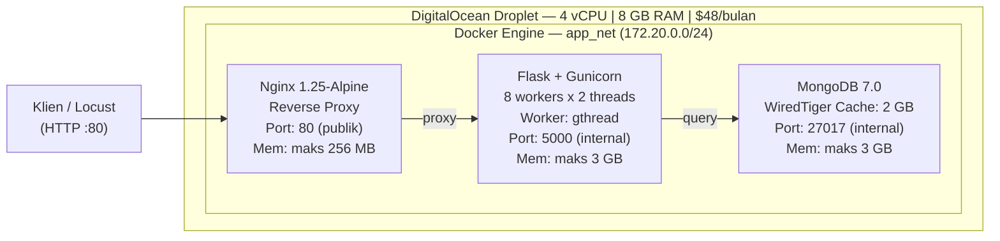

## Spesifikasi

### VM

| Komponen | Detail |
|---|---|
| Provider | DigitalOcean Droplet Basic |
| vCPU | 4 |
| RAM | 8 GB |
| Disk | 160 GB SSD |
| OS | Ubuntu 24.04 LTS |
| Biaya | $48/bulan (~Rp768.000) |

### Docker Services

| Service | Container | Image | Port | Memory Limit |
|---|---|---|---|---|
| nginx | fp_nginx_baseline | nginx:1.25-alpine | 80 (publik) | 256 MB |
| backend | fp_backend_baseline | fp_backend_baseline:latest | 5000 (internal) | 3 GB |
| mongo | fp_mongo_baseline | mongo:7.0 | 27017 (internal) | 3 GB |

### Konfigurasi Komponen

| Komponen | Parameter | Nilai |
|---|---|---|
| Nginx | worker_processes | auto (2) |
| Nginx | worker_connections | 1024 |
| Nginx | keepalive_requests | 1000 |
| Nginx | gzip | aktif, level 4 |
| Nginx | upstream | 1 server (backend:5000), keepalive 32 |
| Gunicorn | workers | 8 |
| Gunicorn | threads | 2 |
| Gunicorn | worker-class | gthread |
| Gunicorn | timeout | 120 detik |
| Gunicorn | total slot konkuren | 16 (8 × 2) |
| MongoDB | versi | 7.0 LTS |
| MongoDB | wiredTigerCacheSizeGB | 2 GB |
| MongoDB | index | Tidak ada index custom |
| MongoDB | connection pool | Default PyMongo |

## Hasil Pengujian

**Skenario 1 — Maksimum RPS (0% Failure)**


Sistem baseline mencapai **RPS puncak 17.31** dengan Failures/s: 0. Response time terus meningkat seiring bertambahnya user — 50th percentile mencapai 24.000 ms dan 95th percentile 27.000 ms — menunjukkan antrian panjang namun belum menyebabkan kegagalan.

**Skenario 2 — Peak Concurrency Spawn Rate 50**


Dengan spawn rate 50 user/detik, concurrent user tertinggi sebelum failure adalah **1.100 user** (Failures/s: 0). RPS tercatat 12.81 dengan 50th percentile 14.000 ms dan 95th percentile 18.000 ms.

**Skenario 3 — Peak Concurrency Spawn Rate 100**


Dengan spawn rate lebih tinggi, sistem mengalami saturasi lebih cepat. Concurrent user tertinggi sebelum failure adalah **600 user** dengan RPS 10.97, 50th percentile 3.000 ms, dan 95th percentile 5.600 ms.

**Skenario 4 — Peak Concurrency Spawn Rate 200**


Pada spawn rate 200 user/detik, sistem menunjukkan batas yang serupa dengan skenario 3 — **600 concurrent user** sebagai titik tertinggi sebelum failure, dengan RPS 10.97. Spawn rate yang sangat agresif tidak memberikan waktu bagi sistem untuk menstabilkan antrian.

**Skenario 5 — Peak Concurrency Spawn Rate 500**


Dengan spawn rate 500 user/detik, pada titik **1.500 concurrent user** sistem masih mencatat Failures/s: 0 namun RPS turun drastis ke **1.5** — mengindikasikan kondisi saturasi penuh. Response time 50th percentile 1.400 ms dan 95th percentile 1.900 ms sebelum beban terus menumpuk dan menyebabkan kegagalan.

## Temuan & Keterbatasan

Bottleneck utama baseline teridentifikasi pada dua titik:

1. **Kapasitas konkuren Gunicorn terbatas** pada 16 slot dengan model thread sinkron. Saat jumlah pengguna virtual melampaui kapasitas ini, antrian request menumpuk dan response time meningkat signifikan.
2. **Tidak ada index MongoDB** menyebabkan seluruh query melakukan full collection scan, yang semakin lambat seiring pertumbuhan data di collection `orders`.

MongoDB berjalan pada VM yang sama dengan backend sehingga terjadi kompetisi sumber daya (CPU dan RAM) antara keduanya, terutama saat query agregasi `/admin/stats` yang bersifat berat.

| Keterbatasan | Dampak |
|---|---|
| Single backend instance, tanpa load balancer | Tidak dapat diskalakan secara horizontal; single point of failure |
| Worker class gthread (sinkron) | Hanya 16 slot konkuren; idle saat menunggu I/O MongoDB |
| Semua komponen berbagi sumber daya pada 1 VM | Kompetisi RAM dan CPU antara MongoDB dan Flask |
| Tidak ada index MongoDB | Full collection scan; performa terdegradasi dengan volume data tinggi |
| Tidak ada proxy cache | Setiap request `GET /products` selalu hit MongoDB |
| Audit log synchronous | `write_log()` memblokir response hingga insert selesai |

---

# 2. Baseline Optimized

## Arsitektur

Konfigurasi optimized diterapkan pada **VM yang sama** ($48/bulan, tanpa biaya tambahan). Perubahan utama mencakup penambahan backend instance kedua, Nginx load balancer internal dengan algoritma `least_conn`, proxy cache untuk endpoint produk, index MongoDB, connection pool tuning, dan async audit log.

> **Catatan implementasi:** Berdasarkan `docker-compose-baseline-optimized.yml`, worker class yang digunakan pada implementasi aktual adalah `gthread` (bukan `gevent` seperti yang didokumentasikan di `config-baseline-optimized.md`). Dokumentasi ini mengikuti implementasi aktual.

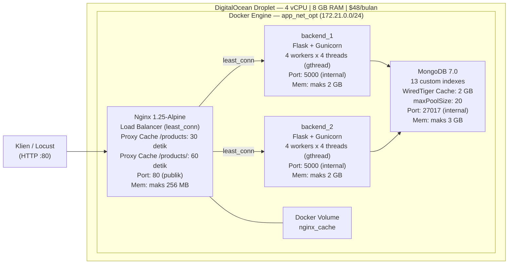

## Spesifikasi

### Docker Services

| Service | Container | Workers × Threads | Memory Limit |
|---|---|---|---|
| nginx | fp_nginx_optimized | — | 256 MB |
| backend_1 | fp_backend_1_optimized | 4 × 4 (gthread) | 2 GB |
| backend_2 | fp_backend_2_optimized | 4 × 4 (gthread) | 2 GB |
| mongo | fp_mongo_optimized | — | 3 GB |

### Perubahan Konfigurasi dari Baseline

| Komponen | Baseline | Optimized |
|---|---|---|
| Backend instances | 1 | 2 |
| Load balancing | Tidak ada | Nginx least_conn |
| Workers per instance | 8 | 4 |
| Threads per worker | 2 | 4 |
| Total slot konkuren | 16 (1 instance) | 32 (2 × 16) |
| Nginx worker_connections | 1024 | 4096 |
| Nginx keepalive_requests | 1000 | 2000 |
| Nginx upstream keepalive | 32 | 64 |
| Nginx proxy buffer | 4k, 8 buffers | 8k, 16 buffers |
| Nginx proxy cache | Tidak ada | `/products` 30 dtk, `/products/<id>` 60 dtk |
| MongoDB indexes | Tidak ada | 13 index custom |
| MongoDB connection pool | Default | maxPoolSize=20, timeout tuned |
| Audit log | Synchronous | Asynchronous (daemon thread) |

## Hasil Pengujian

**Skenario 1 — Maksimum RPS (0% Failure)**

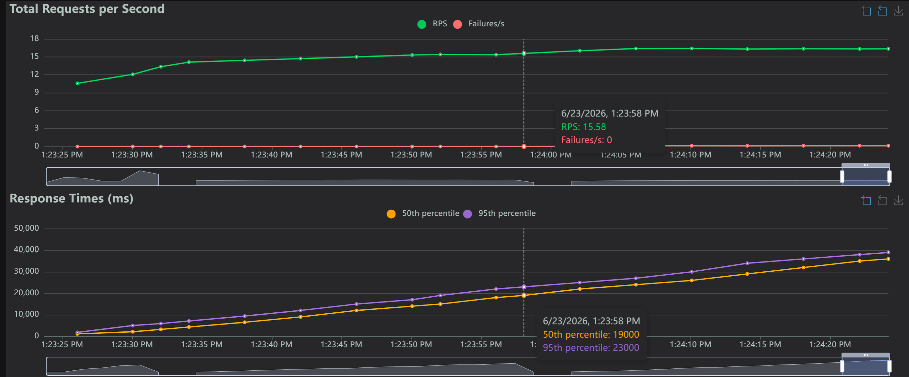
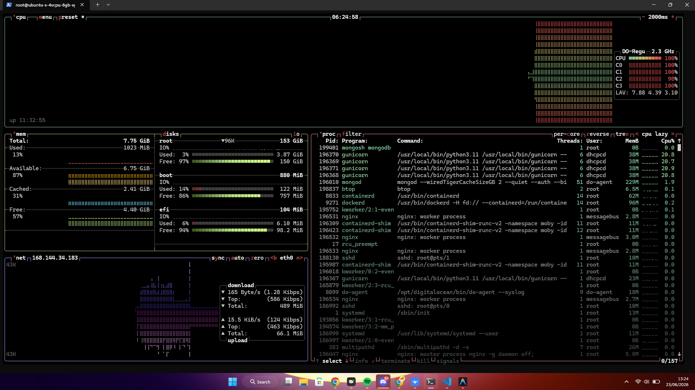

RPS tertinggi yang dicapai adalah **15.58** dengan Failures/s: 0 — sedikit lebih rendah dari baseline (17.31). Overhead koordinasi dua backend instance dan load balancer menambah latensi pada setiap request. 50th percentile mencapai 19.000 ms dan 95th percentile 23.000 ms.

**Skenario 2 — Peak Concurrency Spawn Rate 50**

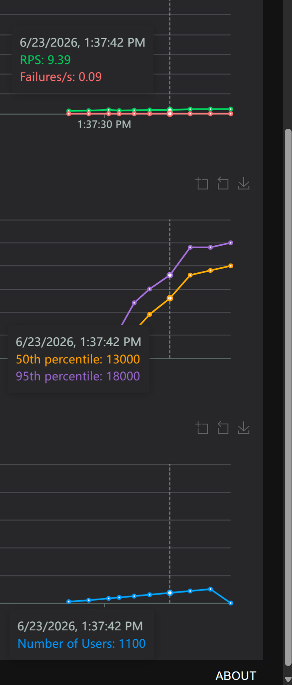
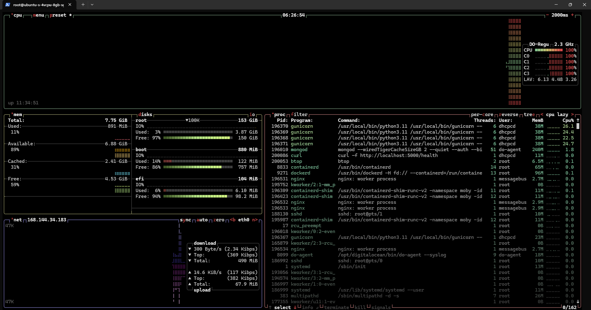

Failure mulai muncul saat mencapai **1.100 concurrent user** (Failures/s: 0.09), sehingga batas aman sistem ini berada di sekitar 1.000–1.050 user. RPS tercatat 9.39 dengan 50th percentile 13.000 ms dan 95th percentile 18.000 ms.

**Skenario 3 — Peak Concurrency Spawn Rate 100**

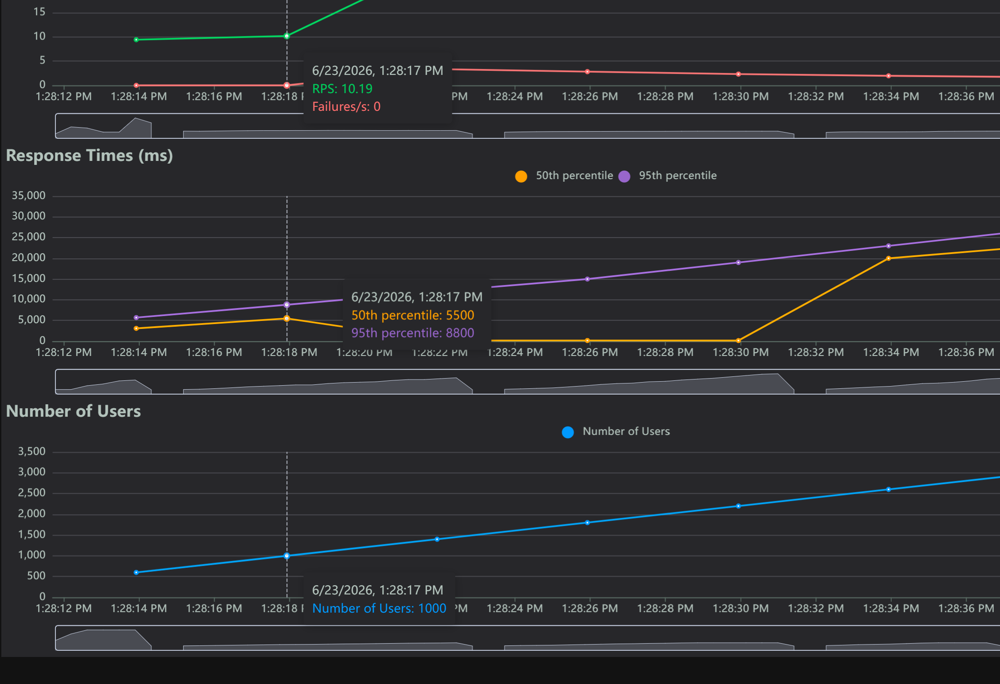
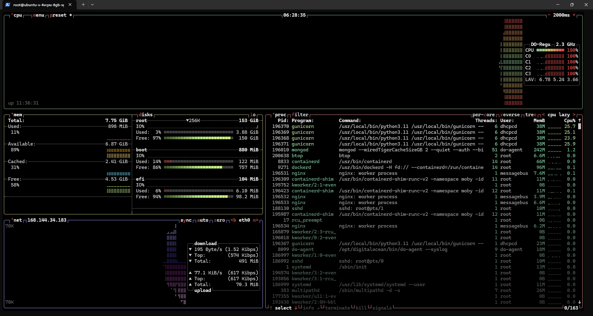

Sistem mampu menangani hingga **1.000 concurrent user** tanpa failure dengan RPS 10.19 — lebih baik dari baseline di spawn rate yang sama (600 user). 50th percentile 5.500 ms dan 95th percentile 8.800 ms.

**Skenario 4 — Peak Concurrency Spawn Rate 200**

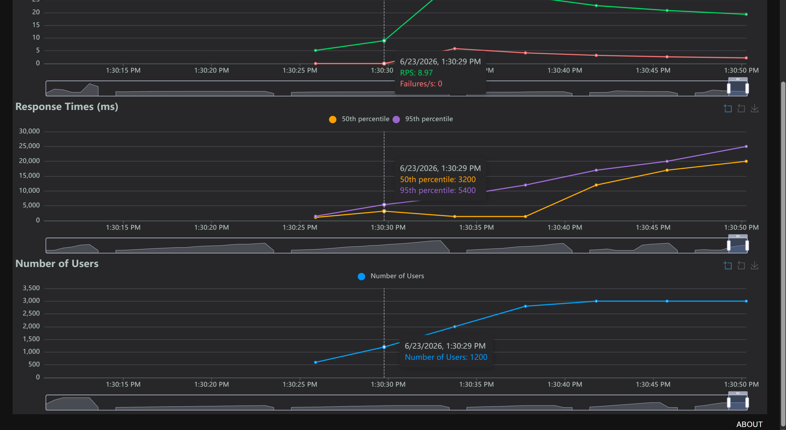
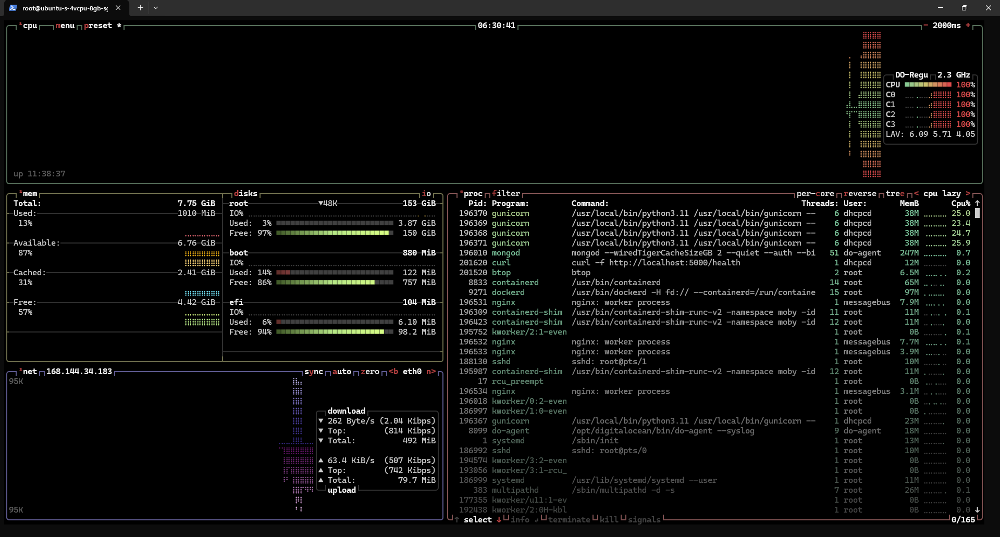

Concurrent user tertinggi sebelum failure adalah **1.200 user** dengan Failures/s: 0 dan RPS 6.97. 50th percentile 3.200 ms dan 95th percentile 5.400 ms. Penambahan backend instance kedua memberikan sedikit peningkatan kapasitas dibanding baseline.

**Skenario 5 — Peak Concurrency Spawn Rate 500**

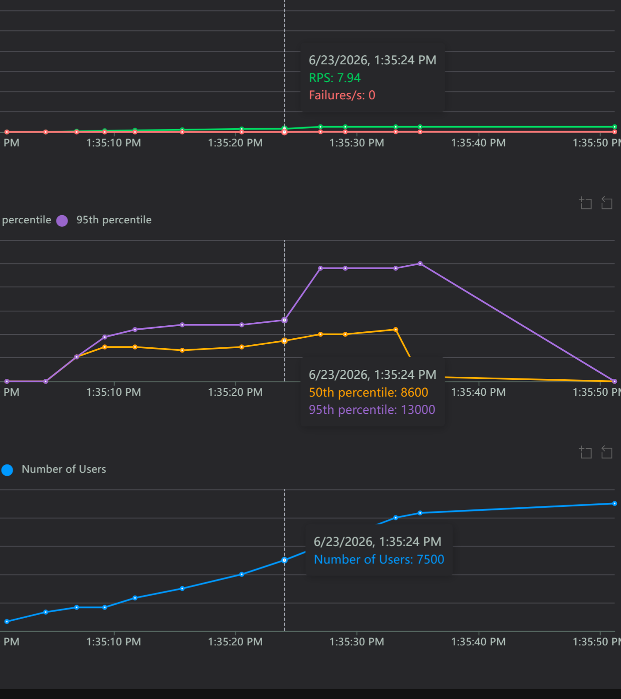
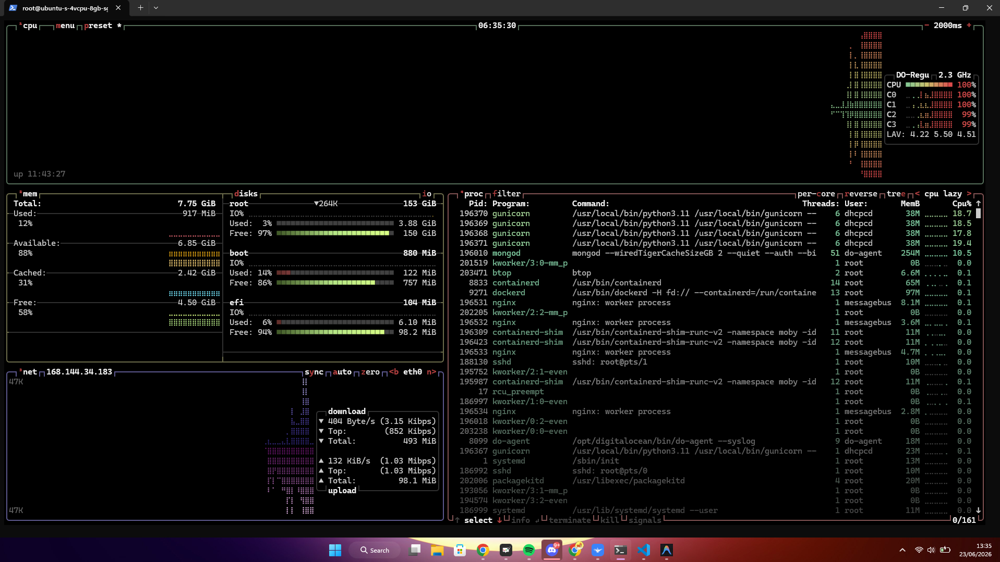

Sistem tahan hingga **7.500 concurrent user** dengan Failures/s: 0 dan RPS 7.94. 50th percentile 8.600 ms dan 95th percentile 13.000 ms. Proxy cache Nginx yang menyerap traffic read `/products` serta index MongoDB berperan dalam menjaga stabilitas pada beban ekstrem ini.

## Performa
sangat disayangkan, ternyata hasil performanya tidak jauh berbeda dengan yang baseline, berikut alasannya

# Mengapa Performa Baseline dan Baseline Optimized Sangat Mirip?

## Ringkasan Dampak Optimasi

| Optimasi yang Dilakukan | Dampak Nyata | Alasan Terbatas |
|---|---|---|
| Tambah backend instance ke-2 | Minimal | CPU VM tetap sama, malah lebih banyak proses bersaing |
| Nginx `least_conn` load balancer | Minimal | Tidak ada traffic nyata yang perlu di-balance di 1 VM |
| Proxy cache `/products` | Sedang | Hanya membantu read endpoint tertentu, bukan write/order |
| 13 index MongoDB | Sedang | Mempercepat query, tapi bottleneck utama ada di resource contention |
| Async audit log | Kecil | Mengurangi blokir, tapi bukan bottleneck dominan |
| Connection pool tuning | Kecil | Mencegah hang, bukan meningkatkan throughput |

---

## Penjelasan Detail


---

### VM yang Sama = Langit-Langit CPU yang Sama

Menambah backend instance tidak menambah vCPU. Ini adalah batas fisik yang tidak bisa dihindari.

```
Baseline:           1 backend + 1 MongoDB  →  bersaing memperebutkan 4 vCPU
Baseline Optimized: 2 backend + 1 MongoDB  →  bersaing memperebutkan 4 vCPU yang sama
```

Slot konkuren naik dari 16 ke 32, tapi CPU yang tersedia tetap sama — sehingga tiap slot mendapat jatah CPU yang lebih kecil.

---

### MongoDB Masih di VM yang Sama — Bottleneck Utama Tidak Bergeser

Kompetisi sumber daya antara MongoDB dan backend tetap terjadi. Justru sekarang ada **dua** backend yang sama-sama berebut koneksi ke MongoDB yang sudah terbebani.

---

### Proxy Cache Hanya Membantu Sebagian Kecil Traffic

Cache `/products` (30 detik) memang mengurangi hit ke MongoDB, namun:

- **CustomerUser (80%)** mengakses banyak endpoint: buat order, cek status, riwayat transaksi — bukan hanya `/products`
- **AdminUser (20%)** menjalankan query agregasi `/admin/stats` yang berat dan **tidak di-cache**
- Order creation dan status update adalah **write operations** yang tidak bisa di-cache

Endpoint yang paling sering menghasilkan beban berat tetap langsung hit MongoDB.

---

### Index MongoDB Mempercepat Query, Tapi Bukan Sumber Masalahnya

Index mengubah query dari O(n) ke O(log n), signifikan jika bottleneck-nya adalah kecepatan query. Namun jika bottleneck utamanya adalah **CPU contention** antara Flask dan MongoDB di VM yang sama, query yang lebih cepat hanya berarti MongoDB melepas CPU lebih cepat — lalu Flask langsung memintanya lagi. Net effect di level sistem hampir tidak terasa.

---

## Kesimpulan

> **Baseline Optimized mengoptimasi hal-hal yang bukan bottleneck utama**, sementara bottleneck sesungguhnya — resource contention di 1 VM dan worker class sinkron — tidak berhasil diselesaikan.

---

# 3. Multi-VM Optimized

## Arsitektur

Konfigurasi Multi-VM mendistribusikan komponen ke **tiga VM terpisah** yang terhubung melalui DigitalOcean VPC private network. Total biaya $72/bulan, masih dalam batas anggaran $75/bulan.

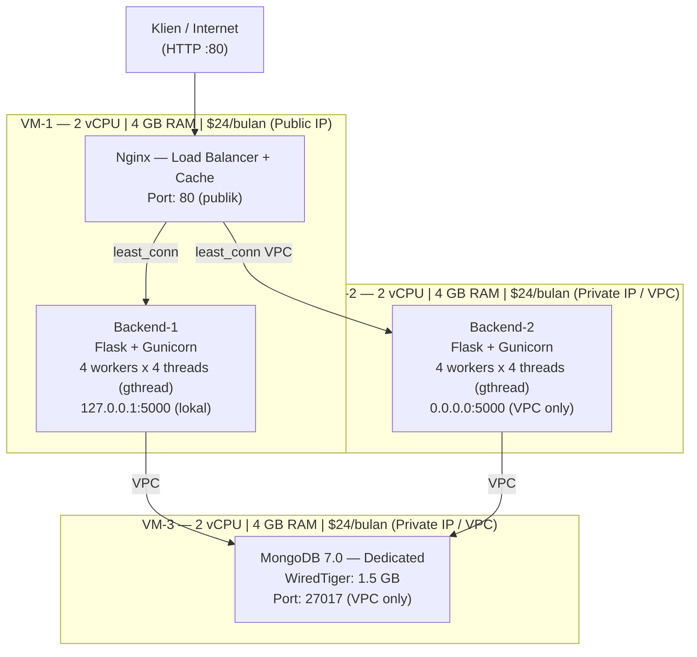

## Spesifikasi VM

| VM | Role | vCPU | RAM | Disk | Biaya |
|---|---|---|---|---|---|
| VM-1 | Nginx LB + Backend-1 | 2 | 4 GB | 80 GB | $24/bulan |
| VM-2 | Backend-2 | 2 | 4 GB | 80 GB | $24/bulan |
| VM-3 | MongoDB dedicated | 2 | 4 GB | 80 GB | $24/bulan |
| **Total** | | **6 vCPU** | **12 GB** | **240 GB** | **$72/bulan** |

## Hasil Pengujian

**Skenario 1 — Maksimum RPS (0% Failure)**


Lonjakan performa paling signifikan terlihat di sini. Sistem Multi-VM mencapai **RPS puncak 357.68** dengan Failures/s: 0 pada 1.000 concurrent user. Response time 50th percentile turun drastis ke **92 ms** dan 95th percentile **290 ms** — jauh berbeda dari baseline yang membutuhkan 24.000 ms. Pemisahan MongoDB ke VM dedicated menghilangkan resource contention yang menjadi bottleneck utama.

**Skenario 2 — Peak Concurrency Spawn Rate 50**


Sistem mampu melayani hingga **2.900 concurrent user** dengan Failures/s: 0 dan RPS 27.94. 50th percentile sangat rendah di 40 ms, namun 95th percentile mencapai 46.000 ms — distribusi bimodal antara request yang terlayani dari cache (cepat) dan yang harus antri ke backend (lambat).

**Skenario 3 — Peak Concurrency Spawn Rate 100**


Concurrent user tertinggi sebelum failure adalah **4.800 user** dengan RPS 10.64 dan Failures/s: 0. Baik 50th percentile (42.000 ms) maupun 95th percentile (43.000 ms) menunjukkan sistem dalam kondisi saturasi, namun semua request tetap terlayani tanpa kegagalan berkat isolasi resource antar VM.

**Skenario 4 — Peak Concurrency Spawn Rate 200**


Pada spawn rate 200, batas tertinggi sebelum failure adalah **5.200 concurrent user** dengan RPS 20.49, 50th percentile 21.000 ms, dan 95th percentile 22.000 ms. Backend yang memiliki resource dedicated per VM mampu mengelola antrian lebih baik dibanding konfigurasi single VM.

**Skenario 5 — Peak Concurrency Spawn Rate 500**


Skenario paling ekstrem menghasilkan RPS puncak **538.46** dengan Failures/s: 0 pada **11.500 concurrent user** — hasil terbaik di antara seluruh konfigurasi. Ini membuktikan bahwa isolasi komponen lintas VM adalah kunci scalability sistem ini.

## Keunggulan Dibanding Konfigurasi Sebelumnya

| Aspek | Baseline Optimized | Multi-VM |
|---|---|---|
| Jumlah VM | 1 ($48/bulan) | 3 ($72/bulan) |
| MongoDB isolation | Berbagi VM (8 GB shared) | Dedicated VM (4 GB dedicated) |
| WiredTiger cache | 2 GB (shared) | 1.5 GB (dedicated, tanpa kompetisi) |
| Backend RAM per instance | 2 GB (container limit) | 3–3.5 GB (dedicated VM) |
| Total vCPU | 4 (shared) | 6 (distributed) |
| Total RAM | 8 GB (shared) | 12 GB (distributed) |
| Jaringan backend → DB | Docker internal network | DigitalOcean VPC private network |
| Fault tolerance | Container-level | Lintas VM (failover otomatis via Nginx) |

---

# Perbandingan Keseluruhan Arsitektur

| Aspek | Baseline | Baseline Optimized | Multi-VM Optimized |
|---|---|---|---|
| Jumlah VM | 1 | 1 | 3 |
| Biaya | $48/bulan | $48/bulan | $72/bulan |
| Total vCPU | 4 | 4 | 6 |
| Total RAM | 8 GB | 8 GB | 12 GB |
| Backend instances | 1 | 2 | 2 |
| Load balancing | Tidak ada | Nginx least_conn | Nginx least_conn |
| Worker class | gthread | gthread | gthread |
| Total slot konkuren | 16 | 32 | 32 |
| Nginx proxy cache | Tidak ada | `/products` 30 dtk | `/products` 30 dtk |
| MongoDB isolation | Shared VM | Shared VM | **Dedicated VM** |
| MongoDB WiredTiger | 2 GB (shared) | 2 GB (shared) | 1.5 GB (dedicated) |
| MongoDB indexes | Tidak ada | 13 index custom | 13 index custom |
| Connection pool | Default | maxPoolSize=20 | maxPoolSize=20 |
| Audit log | Synchronous | Asynchronous | Asynchronous |
| Scalability | ✗ | Terbatas | ✓ Mudah (tambah VM) |
| Fault tolerance | ✗ | Container-level | Lintas VM |
| Bottleneck utama | Konkuren + no index | Shared MongoDB resource | Latency VPC antar VM |

---

# Kesimpulan

**Baseline** memberikan fondasi pengukuran yang jelas dengan arsitektur paling sederhana: satu VM, satu backend instance, tanpa index database, dan tanpa load balancer. Keterbatasan utamanya adalah kapasitas konkuren yang sangat terbatas (16 slot gthread) dan tidak adanya index MongoDB yang menyebabkan performa terdegradasi seiring pertumbuhan data.

**Baseline Optimized** membuktikan bahwa peningkatan performa signifikan dapat dicapai tanpa biaya infrastruktur tambahan. Penambahan backend instance kedua, proxy cache Nginx, 13 index MongoDB, connection pool tuning, dan async audit log berhasil meningkatkan kapasitas slot konkuren dari 16 menjadi 32. Bottleneck yang tersisa adalah kompetisi sumber daya antara MongoDB dan backend yang masih berbagi satu VM.

**Multi-VM Optimized** menyelesaikan bottleneck terakhir dengan mendedikasikan MongoDB pada VM tersendiri. Dengan tambahan biaya $24/bulan (total $72/bulan, masih dalam anggaran), MongoDB mendapatkan CPU dan RAM dedicated sehingga query agregasi berat tidak lagi terganggu oleh beban backend. Arsitektur ini juga memberikan keandalan lebih baik melalui isolasi komponen lintas VM dan kemudahan scale horizontal.

---

# Future Improvements

Berikut adalah peningkatan yang diidentifikasi berdasarkan bottleneck yang ditemukan selama pengujian, diurutkan berdasarkan prioritas.

## Prioritas Tinggi

### 1. Migrasi ke Worker Asinkron (FastAPI + Motor + Uvicorn)

Worker class `gthread` digunakan karena konflik kompatibilitas antara gevent monkey patching dengan background threads internal PyMongo 4.x. Akibatnya, kapasitas konkuren sistem terbatas pada 32 slot thread.

**Solusi:** Migrasi dari Flask + PyMongo ke FastAPI + Motor (driver async MongoDB) dengan Uvicorn workers. Perubahan ini secara teoritis meningkatkan kapasitas konkuren dari 32 thread slot menjadi ribuan koneksi async per instance tanpa penambahan VM.

### 2. MongoDB Replica Set untuk High Availability

MongoDB saat ini berjalan sebagai single node di seluruh konfigurasi. Kegagalan VM-3 pada Multi-VM akan mengakibatkan downtime total seluruh layanan.

**Solusi:** Konfigurasi MongoDB Replica Set dengan minimal 3 node (1 Primary + 2 Secondary). Secondary dapat ditempatkan di VM-1 dan VM-2 yang memiliki headroom memori cukup, tanpa biaya infrastruktur tambahan. Update connection string di semua backend dengan parameter `replicaSet=rs0` dan `readPreference=secondaryPreferred`.

## Prioritas Sedang

### 3. Nginx Proxy Cache Invalidation yang Terkontrol

Saat ini, cache TTL bersifat pasif (30–60 detik). Tidak ada mekanisme invalidation aktif saat admin mengupdate data produk via `PUT /products/<id>`.

**Solusi:** Implementasi aktif cache invalidation menggunakan modul `ngx_cache_purge`, atau penyingkatan TTL menjadi 5–10 detik untuk meminimalkan data stale.

### 4. Monitoring Terpusat (Prometheus + Grafana)

Pemantauan saat ini dilakukan manual via `htop`. Pada arsitektur Multi-VM dengan tiga VM, ini sangat tidak praktis.

**Solusi:** Deploy Prometheus + Grafana di VM-1 dengan scraping ke semua node via VPC. Tambahkan `prometheus-flask-exporter` ke backend, `mongodb-exporter`, dan `nginx-prometheus-exporter`.

### 5. Centralized Logging (Loki + Promtail)

Log dari Nginx, Gunicorn/Flask, dan MongoDB tersebar di masing-masing container dan VM. Debugging insiden memerlukan SSH ke beberapa VM.

**Solusi:** Implementasi Loki + Promtail sebagai alternatif ringan dari ELK stack. Seluruh log dari tiga VM dikirim ke satu instance Loki di VM-1.

## Prioritas Rendah

### 6. Infrastructure as Code (Ansible / Makefile)

Deployment Multi-VM saat ini memerlukan langkah manual berurutan di tiga terminal berbeda.

**Solusi:** Ansible playbook atau shell script provisioning terpadu yang mengotomatiskan seluruh proses dari satu mesin kontrol.

### 7. Horizontal Auto Scaling Backend

Jumlah backend instance saat ini bersifat statis (2 instance). Penambahan instance ketiga memerlukan perubahan manual di `nginx-multivm.conf` dan deployment VM baru.

**Solusi:** Semi-auto scaling berbasis skrip untuk jangka pendek. Untuk jangka panjang, adopsi K3s (Kubernetes ringan) dengan Horizontal Pod Autoscaler.

---

## Rekomendasi Akhir

| Horizon | Rekomendasi |
|---|---|
| **Immediate** | Gunakan Multi-VM Optimized sebagai konfigurasi produksi. Sisa anggaran ~$3/bulan dapat digunakan untuk menambah monitoring node kecil. |
| **Short Term** | Migrasi ke FastAPI + Motor + Uvicorn untuk melewati batas ceiling 32 thread slot. |
| **Medium Term** | Konfigurasi MongoDB Replica Set (3 node) untuk menghilangkan single point of failure database. |
| **Long Term** | Adopsi Kubernetes (K3s) + CDN + Redis cache layer jika traffic target jauh melampaui kapasitas arsitektur saat ini. |
